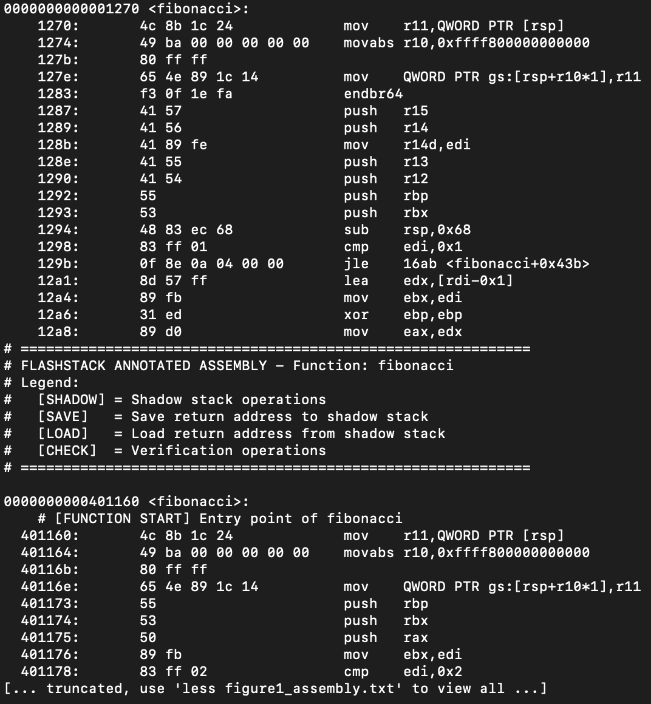

# FLASHSTACK Shadow Stack — Independent Empirical Evaluation
 
> Controlled replication of FLASHSTACK, a compiler-based software shadow stack for
> x86-64, on AWS EC2 — validating its protection against return-address hijacking and
> characterising its real deployment costs.
>
> **Headline result:** measured runtime performance *improved* by 3.45% against a
> reported +5.50% overhead in the original paper — an **8.95% deviation** traced to
> compiler backend and workload scale effects.
 
**Stack:** C · LLVM/Clang 7.0 (`spa-clang`) · gcc · x86-64 assembly · objdump · AWS EC2 (t3.micro, Ubuntu 24.04)
 
---
 
## Why This Project
 
Stack buffer overflows have been a known threat since *Smashing the Stack for Fun and
Profit* (Aleph One, 1996), yet remain exploitable because the traditional call stack
stores program data and control information in the same memory region. Stack canaries
can be bypassed via information disclosure; ASLR makes exploitation harder without
preventing corruption itself.
 
Shadow stacks address this architecturally — keeping a protected copy of return
addresses in an isolated region and comparing on return. FLASHSTACK (Zou et al., 2022)
implements this through LLVM instrumentation, running on commodity x86-64 without
requiring Intel CET hardware support.
 
The original paper reports roughly 5% overhead on SPEC benchmarks. **Independent
validation of that claim on different workloads was limited** — this project addresses
that gap.
 
---
 
## Methodology
 
### Environment
 
FLASHSTACK toolchain built from source on an AWS EC2 t3.micro (Ubuntu 24.04 LTS),
chosen for a clean, documented, reproducible setup. The build required Rust 1.43 as a
dependency and produced the custom `spa-clang` compiler.
 
### Vulnerable target
 
A minimal C program (`vulnerable.c`) with a classic stack overflow: a 100-byte stack
buffer filled via `strcpy` with no bounds checking — allowing input beyond 100 bytes to
overwrite adjacent stack memory including the saved return address.
 
### Two-phase controlled experiment
 
| | Phase A (control) | Phase B (experimental) |
|---|---|---|
| Compiler | `gcc -fno-stack-protector` | `spa-clang` (FLASHSTACK) |
| Binary | `vulnerable_gcc` | `vulnerable_flashstack` |
| Attack payload | 200 × `'A'` | 200 × `'A'` (identical) |
 
`-fno-stack-protector` explicitly disables default canary protection so a pure
return-address overwrite could be observed. The FLASHSTACK runtime was activated via
the provided `runtime.sh` before executing the protected binary.
 
### Measurements collected
 
1. **Attack outcome** — behavioural difference under identical payload
2. **Binary size** — file size comparison across four configurations
3. **Runtime performance** — `time` over repeated rounds on a suite of test programs
4. **Assembly-level analysis** — `objdump -d` to inspect inserted instrumentation
---
 
## Results
 
### 1. Attack mitigation — confirmed
 
**Phase A:** the unprotected binary crashed with a Bus error at
`0x4141414141414141` — the return address had been fully overwritten with the attack
payload, confirming the vulnerability was real and exploitable.
 
**Phase B:** under the identical payload, the FLASHSTACK runtime detected the mismatch
between the corrupted return address on the data stack and the legitimate copy on the
shadow stack, terminating execution immediately with a security violation. No malicious
control-flow transfer occurred.
 
### 2. Binary size overhead — 88.88%, but not where expected
 
| Component | Baseline | Stack Canary | FlashStack | FlashStack Total |
|---|---|---|---|---|
| Binary | 16,280 | 16,336 | 16,128 | — |
| Runtime library | — | — | — | +14,632 |
| **Total** | **16,280** | **16,336** | **16,128** | **30,760** |
| Overhead | — | +0.34% | **−0.93%** | **+88.88%** |
 
The instrumented binary is **smaller than baseline** (−0.93%). The entire 88.88%
overhead originates from the fixed runtime library (14,632 bytes) — meaning the core
instrumentation cost is negligible and the protection cost is concentrated in support
infrastructure.
 
### 3. Runtime performance — an 8.95% deviation from the paper
 
| Configuration | Result | Notes |
|---|---|---|
| Baseline | 0.290s | mean of 5 rounds |
| Stack Canary | +0.00% | no measurable overhead |
| **FlashStack** | **−3.45%** | performance *improvement* |
| Paper (SPEC) | +5.50% | reported in original study |
| **Deviation** | **−8.95 pp** | this study vs. paper |
 
Baseline measurements were stable across rounds (CV 0.00%), so the deviation is not
measurement noise.
 
**Attribution:** LLVM's aggressive optimisations in `spa-clang` appear to offset
instrumentation cost on small, simple workloads, compounded by backend differences
between `spa-clang` and `gcc`. This is workload-dependent and should not be assumed to
generalise to larger applications.
 
### 4. Assembly-level analysis — overhead scales with call depth
 
The instrumentation is directly visible in the disassembly. At function entry,
FLASHSTACK loads the shadow stack base into `r10` and writes the return address
through the GS segment register — `mov QWORD PTR gs:[rsp+r10*1], r11` — maintaining a
protected copy that the epilogue later verifies against.
 

 
| Function | Baseline | FlashStack | Overhead | GS (shadow stack) ops |
|---|---|---|---|---|
| fibonacci | 51 | 51 | 0.00% | 1 → 3 (+2) |
| string | 51 | 51 | 0.00% | 3 → 4 (+1) |
| level1 | 18 | 51 | **+183.33%** | 2 → 3 (+1) |
 
For simple functions, FLASHSTACK adds **no additional assembly lines** while increasing
shadow stack (GS) operations — indicating instruction *replacement* rather than
appending. `level1`, with more complex call patterns, shows a 183% line increase.
 
The key insight: **instrumentation scales linearly with function call depth, not with
program complexity** — a favourable property for predictable deployment planning.
 
### 5. Reconciling the 88.88% with the paper's ~18%
 
| Metric | This test program | SPEC CPU2006 |
|---|---|---|
| Base program size | ~16 KB | ~1 MB |
| Number of functions | ~10 | ~1000 |
| Fixed overhead (runtime lib) | ~15 KB | ~50 KB |
| Per-function cost | ~10 bytes | ~10 bytes |
| **Total overhead** | **+88.88%** | **~18%** |
 
Small programs bear disproportionate percentage overhead because fixed costs dominate.
Modelling this as `Overhead = (C_fixed + C_per_func × N) / Base_Size(N)`:
`(15KB + 0.1KB) / 16KB ≈ 94%` versus `(50KB + 10KB) / 1MB ≈ 6%`. The two figures are
not in conflict — **overhead scales inversely with program size**, which is the
critical fact for deployment planning.
 
 
---
 
## Conclusions
 
FLASHSTACK reliably prevents return-address manipulation, terminating execution on
detection. Its costs are real but **bounded and predictable**: binary size overhead is
dominated by a fixed runtime library that amortises favourably at scale, and runtime
impact on the tested workloads was negligible to slightly positive.
 
The primary contribution here is **independent verification** — confirming the security
guarantee holds on a different platform and workload, and characterising where the
published overhead figures do and don't transfer.
 
---
 
## Limitations & Future Work
 
Testing was confined to simple programs on x86-64 and did not evaluate resilience
against return-oriented programming (Shacham, 2007). Future work should extend to
larger codebases and assess advanced exploitation techniques.
 
---
 
## What This Demonstrates
 
- Building a modified LLVM/Clang toolchain from source and operating it end-to-end
- Designing a controlled two-phase experiment that isolates a single variable
- Reading compiler-inserted security instrumentation at the assembly level
- **Not accepting a published figure at face value** — measuring, finding an 8.95%
  deviation, and explaining its cause rather than reporting it as an anomaly
---
 
## Repository Structure
 
```
flashstack-shadow-stack/
├── README.md
├── figures/
│   └── assembly_comparison.png     annotated objdump: baseline vs instrumented
└── report/
    └── Empirical Evaluation of FLASHSTACK: A Shadow Stack Implementation
for Mitigating Stack Overflow Attacks.pdf    full academic write-up
```
 
---
 
## References
 
Zou et al. (2022) *Practical Software-Based Shadow Stacks on x86-64* — the foundational
study replicated here. Also: Aleph One (1996) · Cowan et al. (1998) StackGuard ·
PaX Team (2003) ASLR · Abadi et al. (2009) CFI · Kuznetsov et al. (2014) CPI ·
Dang et al. (2015) · Shacham (2007) ROP. Full reference list in the report.
 
---
 
*Coursework project completed as part of the Master of Cyber Security, UNSW Canberra (ADFA).*
